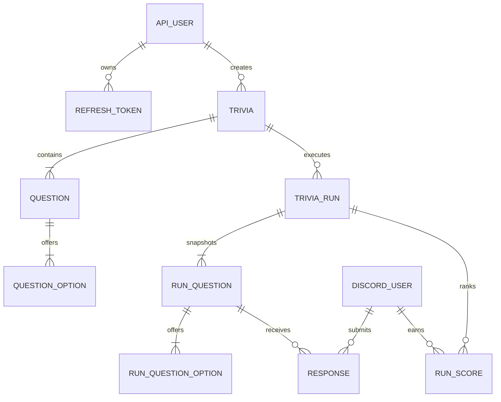
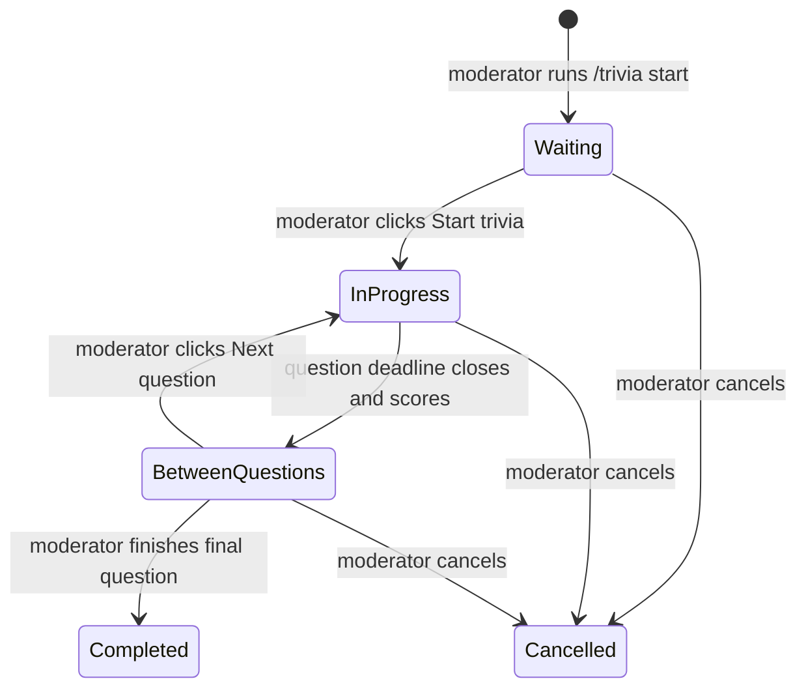

# Trivia Platform Refactor and API Plan

Status: **Approved for implementation on 2026-07-02**  
The recommendations in section 13 are approved, subject to the SQLite and other inline DEV NOTE overrides in this document.

Implementation status: **Code complete on 2026-07-02.** Production secrets, command registration, and live Discord acceptance remain operational deployment tasks.

## 1. Outcome

Turn the current single-file-oriented Discord quiz bot into a modular trivia platform with:

- Authenticated REST CRUD for trivia definitions and their questions.
- Public, read-only ranking endpoints for a future website.
- Persisted Discord trivia runs that survive process restarts.
- Per-run, per-trivia, and overall user performance.
- Moderator-controlled Discord progression using roles configured through environment variables.
- Explicit database migrations, validation, tests, API documentation, and operational safeguards.

The proposed implementation is a modular monolith: the API and Discord bot share domain services and one database, but have separate adapters and entry points. This avoids duplicating scoring and validation logic and leaves open the option to deploy the API and bot as separate processes later.

## 2. Important terminology

The requested “Trivia Session” currently represents two different concepts. They must be separate in the data model:

- **Trivia**: an authored definition, such as “Friday Night Quiz,” containing its description and ordered questions.
- **Trivia run**: one live execution of that trivia in a Discord channel at a specific time.
- **Question**: an authored question belonging to exactly one trivia.
- **Run question**: an immutable snapshot of a question used by a particular run.

This distinction permits a trivia to be reused, keeps rankings for each occurrence, and prevents later edits from changing historical results.

## 3. Current-state findings

The current application has several constraints that the refactor must address:

- `index.js` owns startup, database initialization, commands, button routing, and ranking rendering.
- `trivia.js` owns Discord presentation, in-memory participants, timers, result calculation, and database writes.
- Questions are standalone records whose answer options are stored as JSON. The first array item is implicitly correct.
- Rankings are one cumulative row per Discord user, so no session-level history exists.
- Users contain only the Discord snowflake ID.
- `sequelize.sync()` runs during application startup; there is no migration history.
- Timers and participants are in memory. A restart loses the active question state and uncommitted answers.
- Authorization contains hard-coded user/role IDs.
- SQLite is accessed through a relative path and is the only configured database.
- There is no API server, request validation, test suite, structured logging, or health check.

The local database currently has zero questions and 25 ranking/user rows. Production data must still be treated as unknown and preserved by a tested migration. Database file should be in .gitignore.

## 4. Recommended technical direction

### 4.1 Runtime and code organization

Recommended choices:

- Migrate the application to TypeScript during the boundary refactor.
- Use a pinned, supported Node.js LTS release.
- Keep Sequelize initially to reduce data-layer migration risk.
- Replace `sequelize.sync()` with versioned Umzug/Sequelize migrations.
- Add Fastify for the HTTP API, schema validation, request limits, and structured request logging.
- Generate an OpenAPI document from the API route schemas.

Proposed structure:

```text
src/
  api/
    app.ts
    routes/
    middleware/
    schemas/
  bot/
    client.ts
    commands/
    interactions/
    presenters/
  config/
    env.ts
  db/
    sequelize.ts
    models/
    migrations/
    repositories/
  domain/
    trivia/
    runs/
    ranking/
    auth/
  services/
    trivia-service.ts
    run-service.ts
    scoring-service.ts
  jobs/
    question-deadline-worker.ts
  bin/
    app.ts
    deploy-commands.ts
tests/
  unit/
  integration/
  fixtures/
```

Domain services must not import Discord or Fastify. The API and Discord handlers call the same services, transactions, and authorization policies.

### 4.2 Identity decision

Do **not** replace the Discord user ID with a username. Discord IDs are stable; usernames and display names can change and are not reliable unique keys.

Store both:

- `discord_user_id`: stable internal identity and unique key.
- `username`: latest Discord username.
- `display_name`: latest guild/global display name shown publicly.
- Optional avatar metadata and `last_seen_at`.

Refresh these display fields whenever the user interacts with a trivia. Public API responses should use an application-level public user ID and display name, not require consumers to use the Discord snowflake. A historical response may also store a display-name snapshot if historical presentation must not change.

## 5. Data model

All new primary keys should be UUIDs. Timestamps are stored in UTC. Foreign keys and useful composite indexes are mandatory.



### 5.1 Authoring tables

`trivias`

- `id` UUID primary key.
- `name` required, trimmed, maximum length defined by API schema.
- `description` required or explicitly nullable; maximum length defined.
- `language` BCP-47-compatible short code, defaulting to the configured language.
- `status`: `draft`, `published`, or `archived`.
- `default_question_duration_seconds`, bounded to an approved range.
- `created_by_api_user_id`, `created_at`, `updated_at`, `published_at`.
- `version` integer for optimistic concurrency.
- Optional `deleted_at` only if soft deletion is retained separately from `archived`.

`questions`

- `id` UUID primary key.
- `trivia_id` required foreign key.
- `prompt` required text.
- `position` required integer, unique within a trivia.
- Optional per-question `duration_seconds`; otherwise inherit the trivia default.
- `points` positive integer, default `1`.
- `prize` non-negative decimal number, value users will receive in $ZEC if they answer correctly.
- `created_at`, `updated_at`, and `version`.

`question_options`

- `id` UUID primary key.
- `question_id` required foreign key.
- `text` required.
- `position` required integer, unique within a question.
- `is_correct` required boolean.

Initial release rules: each question has 2–4 options and exactly one correct option. These rules are enforced in service validation and, where possible, with database constraints. Creating/updating a question and all of its options is one transaction.

Published trivia content is immutable in place once it has a run. Editing it creates a new revision or requires duplicating it into a draft. This prevents history and audit ambiguity. Drafts without runs can be edited or hard-deleted; published/used records are archived.

### 5.2 Execution tables

`trivia_runs`

- `id` UUID primary key.
- `trivia_id` foreign key and source trivia version.
- `status`: `waiting`, `in_progress`, `between_questions`, `completed`, or `cancelled`.
- `guild_id`, `channel_id`, intro/control message IDs.
- `started_by_discord_user_id` and optional `completed_by_discord_user_id`.
- `current_question_position`.
- `created_at`, `started_at`, `completed_at`, and `cancelled_at`.
- Optional `prize` metadata retained from the existing feature, but payout automation is not expanded in this project.

`run_questions` and `run_question_options`

- Copy the prompt, option texts, correct option, duration, points, and ordering at run creation/start.
- Keep nullable links to source question/option IDs for traceability.
- Store `opened_at`, `closes_at`, and `closed_at` on the run question.

Snapshots ensure an active or completed run never changes when an editor later modifies a trivia definition.

`responses`

- Unique key on `(run_question_id, discord_user_id)`.
- Selected run option, `is_correct`, `points_awarded`, and `answered_at`.
- The server derives correctness; it never trusts button data or client input to declare an answer correct.
- Initial behavior keeps the first submitted answer final, matching the current bot.

`run_scores`

- Unique key on `(trivia_run_id, discord_user_id)`.
- `correct_answers`, `wrong_answers`, `answered_questions`, and `total_points`.
- Updated in the same transaction that closes/scores a question, with an idempotency guard.

Responses remain the source of truth. `run_scores` is a transactionally maintained projection for fast Discord and website ranking queries. Overall scores are sums of run scores rather than a separately mutable global counter.

### 5.3 User and authentication tables

`discord_users`

- Internal UUID primary key.
- Unique `discord_user_id` string.
- Latest `username`, `display_name`, avatar reference, and `last_seen_at`.

`api_users`

- UUID primary key, unique username, password hash, status.
- Role: `admin`. (Only rank is public, no authentication needed to read, only to edit/create/delete/update)
- Login/security timestamps.

`refresh_tokens`

- Token identifier, API user, token hash, expiry, revocation, and rotation metadata.
- Never store a raw refresh token.

## 6. API contract

Base path: `/api/v1`.

Interpret “public, JWT-secured API” as:

- The API is reachable over HTTPS.
- Management and complete trivia/question data require JWT authentication.
- Ranking and safe trivia metadata reads are public.
- Correct answers and draft content are never exposed through public endpoints.

### 6.1 Authentication

- `POST /api/v1/auth/login`
- `POST /api/v1/auth/refresh`
- `POST /api/v1/auth/logout`
- `GET /api/v1/auth/me`

Access tokens should be short-lived (recommended 15 minutes). Refresh tokens should rotate, be revocable, and be delivered to the dashboard using a Secure, HttpOnly, SameSite cookie. If a non-browser API client is required later, add explicitly managed API credentials rather than weakening dashboard token handling.

JWT claims include `sub`, API role, `iss`, `aud`, `iat`, `exp`, and `jti`. Use separate high-entropy access/refresh secrets or asymmetric signing keys, validate configuration on startup, and support key rotation. Passwords use Argon2id. Login is rate-limited and produces generic failure messages.

Bootstrap the first administrator through a one-time CLI command, not a default password committed to source control.

### 6.2 Protected management routes

- `GET /api/v1/trivias` — filter/paginate drafts, published, and archived trivia.
- `POST /api/v1/trivias` — create a draft, optionally with nested questions in one transaction.
- `GET /api/v1/trivias/:triviaId` — full management representation.
- `PATCH /api/v1/trivias/:triviaId` — update metadata with optimistic concurrency.
- `DELETE /api/v1/trivias/:triviaId` — hard-delete unused drafts; archive used trivia.
- `POST /api/v1/trivias/:triviaId/publish` — validate and publish.
- `POST /api/v1/trivias/:triviaId/duplicate` — create an editable draft revision/copy.
- `POST /api/v1/trivias/:triviaId/questions` — add a question and its options atomically.
- `GET /api/v1/trivias/:triviaId/questions/:questionId`.
- `PUT /api/v1/trivias/:triviaId/questions/:questionId` — replace prompt/options atomically.
- `DELETE /api/v1/trivias/:triviaId/questions/:questionId`.
- `PUT /api/v1/trivias/:triviaId/questions/order` — reorder using the complete ordered ID list.

### 6.3 Public routes

- `GET /api/v1/public/trivias` — published metadata only.
- `GET /api/v1/public/trivias/:triviaId` — metadata without questions/correct answers unless explicitly safe after completion.
- `GET /api/v1/public/trivia-runs` — completed run metadata.
- `GET /api/v1/public/trivia-runs/:runId/rankings` — one live occurrence.
- `GET /api/v1/public/trivias/:triviaId/rankings` — aggregate all completed runs of a trivia definition.
- `GET /api/v1/public/rankings/overall` — aggregate all eligible completed runs.
- `GET /api/v1/public/users/:publicUserId/stats` — public profile summary if approved.

Ranking endpoints use stable cursor pagination, include rank/score/correct/wrong counts, and define deterministic ties. Proposed ordering is total points descending, correct answers descending, wrong answers ascending, then stable public user ID. If response speed should affect ties, it must be explicitly approved and stored; it should not be inferred from database update timestamps.

### 6.4 API robustness rules

- Validate path, query, and body data against schemas; reject unknown fields on writes.
- Use a consistent RFC 9457-style problem response with stable application error codes.
- Apply request body size limits, timeouts, rate limits, CORS allowlists, and security headers.
- Use cursor pagination and bounded limits (maximum 100).
- Return `409 Conflict` for stale versions, duplicate positions, and invalid state transitions.
- Support `Idempotency-Key` for create/publish operations that a dashboard may retry.
- Emit an OpenAPI specification and interactive docs, with production docs optionally protected.
- Never include secrets, password hashes, correct answers, or raw tokens in logs.
- Public ranking reads may use short cache headers/ETags; management routes are non-cacheable.

## 7. Discord interaction design

### 7.1 Commands

Recommended command namespace:

- `/trivia start trivia:<autocomplete>`
- `/trivia status`
- `/trivia resume run:<id>`
- `/trivia cancel run:<id>`
- `/rank scope:<overall|trivia|run>`

`/trivia start` is preferable to a top-level `/start` because it leaves a coherent namespace for operational recovery commands. Autocomplete displays the trivia name and a short ID while passing the UUID value. Only published, non-archived trivia are selectable.

Keep `/singlequiz` temporarily behind a legacy feature flag during rollout, then remove it after the new flow is accepted. Replace or deprecate `/jasperquiz` rather than maintaining two run engines.

### 7.2 Moderator authorization

Move all Discord authorization IDs out of source code:

```dotenv
DISCORD_MODERATOR_ROLE_IDS=1078741799306268727,another-role-id
DISCORD_RANK_ADMIN_ROLE_IDS=1078741799306268727
```

Parse these values as validated string sets. Every command and button performs server-side role authorization from the interaction member payload. Button visibility is not treated as authorization. Log denied administrative actions without exposing private role details to users.

### 7.3 Live flow



1. Moderator runs `/trivia start` and selects a published trivia.
2. The service creates a `waiting` run and its immutable question snapshots.
3. The bot posts an intro embed with trivia name, description, question count, and duration, plus `Start trivia` and `Cancel` buttons.
4. A moderator clicks `Start trivia`. An atomic state transition prevents double starts.
5. The first question embed appears with answer buttons and a Discord relative deadline.
6. Each answer is validated against run state/deadline and inserted immediately. Duplicate answers receive an ephemeral response.
7. At the deadline, the worker atomically closes and scores the question, disables answer buttons, and edits the embed to reveal the correct answer and result summary.
8. The result embed includes a moderator-only `Next question` button. Manual progression is the default because this bot accompanies a live weekly call.
9. The final question produces `Finish trivia`; completion posts the run leaderboard and exposes it through public ranking endpoints. Finish trivia should be called after even if the moderator doesn't click it. Display the run rank immediately after trivia ends.

Global interaction routing should replace per-message in-memory collectors. Button custom IDs carry only record identifiers/action names; the database is authoritative for state, authorization, deadline, and correctness.

### 7.4 Timer and restart behavior

`setTimeout` may be used as a local wake-up optimization, but it cannot be the source of truth.

- Persist every question `closes_at` timestamp.
- Run a lightweight deadline worker that claims due open questions and closes them idempotently.
- On startup, reconcile `waiting`, `in_progress`, and `between_questions` runs.
- If a question expired while offline, close/score it once and restore the moderator control message.
- State transitions use conditional updates/transactions so repeated Discord delivery or button clicks are harmless.
- Enforce one active run per channel unless multi-run behavior is explicitly approved.

This design works in one process initially. If bot/API workers later scale horizontally, PostgreSQL row locking or advisory locks can coordinate claims without immediately requiring Redis.

## 8. Ranking behavior

The same scoring service must serve Discord and API results.

- Per-run ranking: one `trivia_run`.
- Per-trivia ranking: sum completed runs belonging to one trivia definition.
- Overall ranking: sum all eligible completed runs.
- Cancelled runs are excluded by default.
- A score is counted only after its question closes successfully.
- Re-running an idempotent close operation cannot double-count answers.
- Users are upserted with fresh display metadata when they answer or moderate.

The existing `/reset-ranking` behavior needs a product decision. Deleting historical responses conflicts with auditability. Recommended replacement: administrative exclusion/reset records or starting a new ranking season. A later `ranking_seasons` table can define weekly/monthly/all-time leaderboards without destructive deletion.
DEV NOTE: /reset-ranking must be gated behing legacy flag until it is removed. I don't think this command should exist in the new platform.

## 9. Migration and compatibility strategy
Create a new sqlite database file.
Further starts should not recreate it, only when altering table is needed.

## 10. Security and operations

- Validate all environment variables before connecting to Discord or accepting HTTP traffic.
- Terminate HTTPS at a trusted reverse proxy; honor proxy headers only when explicitly configured.
- Use least-privilege database credentials and separate production secrets.
- Add `/health/live` and `/health/ready`; readiness verifies database and Discord status appropriately.
- Implement graceful shutdown: stop HTTP intake, stop deadline claims, close Discord, then close database connections.
- Use structured logs with request/run IDs and redaction.
- Record API management actions and run lifecycle changes in an audit log.
- Add SQLite online backups (including WAL-safe handling) and a documented restore drill.
- Apply dependency and container scanning in CI.
- Do not expose Discord tokens, JWT keys, correct answers, or participant Discord IDs unnecessarily.

## 11. Test strategy and acceptance criteria

### 11.1 Automated tests

- Unit: trivia validation, option rules, scoring, ranking ties, permissions, state transitions, and JWT claims.
- Integration: migrations, repositories, all API routes, auth rotation/revocation, conflict handling, pagination, and public response redaction.
- Discord adapter: mocked slash/button interactions, moderator denials, duplicate starts, duplicate answers, deadlines, next-question flow, cancel/resume, and message update failures.
- Recovery: restart during an open question and after a deadline; prove scoring occurs exactly once.
- Migration: import a fixture matching the legacy schema and compare totals.
- Contract: generated OpenAPI validates representative requests/responses.

### 11.2 Definition of done

- An authenticated editor can create, update, reorder, publish, archive, and duplicate trivia through documented API calls.
- Invalid trivia cannot be published.
- Public callers cannot read drafts or correct answers.
- A configured moderator can select and start a published trivia in Discord.
- Non-moderators cannot start, advance, cancel, or finish a run.
- Participant answers persist immediately and duplicates are rejected.
- The bot recovers an active run after restart without double scoring.
- Rankings agree across run, trivia, overall API endpoints, and Discord output.
- Username changes do not split one user into multiple identities.
- Legacy aggregate totals survive migration or are explicitly waived.
- CI runs linting, type checking, unit tests, integration tests, and migration verification.
- Deployment, backup, restore, command registration, and rollback instructions are documented.

## 12. Implementation phases

### Phase 0 — Decisions and safety baseline

- Approve the decisions in section 13.
- Capture production schema/data counts and create a verified backup.
- Add characterization tests around current answering and scoring behavior.
- Define API examples and the moderator flow before changing storage.

### Phase 1 — Application boundaries and tooling

- Add TypeScript, formatting/linting, tests, typed configuration, logging, and graceful startup/shutdown.
- Extract current Discord handlers behind bot/domain service boundaries without changing visible behavior.
- Introduce explicit command registration with no delete/register race.

### Phase 2 — Database and migration foundation

Create the database. Add sequilize models and migrations.

### Phase 3 — Authenticated authoring API

- Implement API-user bootstrap, login, refresh rotation, logout, and authorization.
- Implement trivia/question CRUD, validation, ordering, publish/archive/duplicate behavior.
- Add OpenAPI, error contracts, rate limits, CORS, and audit events.

### Phase 4 — Persisted run and scoring domain

- Implement snapshots, responses, idempotent question closure, run scores, and aggregate ranking queries.
- Add the deadline worker and startup reconciliation.
- Expose public run/trivia/overall ranking endpoints.

### Phase 5 — Discord moderator flow

- Implement `/trivia start` autocomplete and role configuration.
- Implement intro/start/cancel, question answering, timeout result, next/finish, status/resume, and final leaderboard.
- Rewire `/rank`; keep legacy commands behind a feature flag during acceptance.

### Phase 6 — Cutover and hardening

- Deploy to staging and run moderator/participant acceptance tests.
- Perform production backup, migration, reconciliation, command registration, and smoke tests in a maintenance window.
- Monitor errors, timer recovery, API latency, authentication failures, and ranking consistency.
- Remove legacy paths only after the rollback window closes.

Each phase should be delivered as a separately reviewable change. Database migrations and behavior changes should not be mixed into one unreviewable rewrite.

## 13. Approval decisions

The following recommended choices were approved on 2026-07-02.

- [x] **Language:** migrate to TypeScript during refactoring.
- [x] **Command name:** `/trivia start` with subcommands.
- [x] **Progression:** moderator-paced `Next question`.
- [x] **Question answers:** exactly one correct option and 2–4 options for the initial release.
- [x] **Trivia reuse:** allow multiple runs from one published definition.
- [x] **Legacy ranking:** import as a hidden synthetic run.
- [x] **Ranking ties:** points, correct, wrong, stable ID.
- [x] **Public identity:** display name plus application public user ID; avatars are not public initially.
- [x] **Authentication:** local API users with Argon2id, short JWT access tokens, and rotating refresh cookies.
- [x] **Legacy commands:** temporarily feature-flag `/singlequiz` and `/jasperquiz`.
- [x] **Ranking reset:** omit destructive reset from the new platform; legacy command remains feature-flagged until removal.

Inline final considerations override earlier general recommendations. In particular, the first platform release uses a new SQLite database managed by versioned migrations rather than PostgreSQL.
